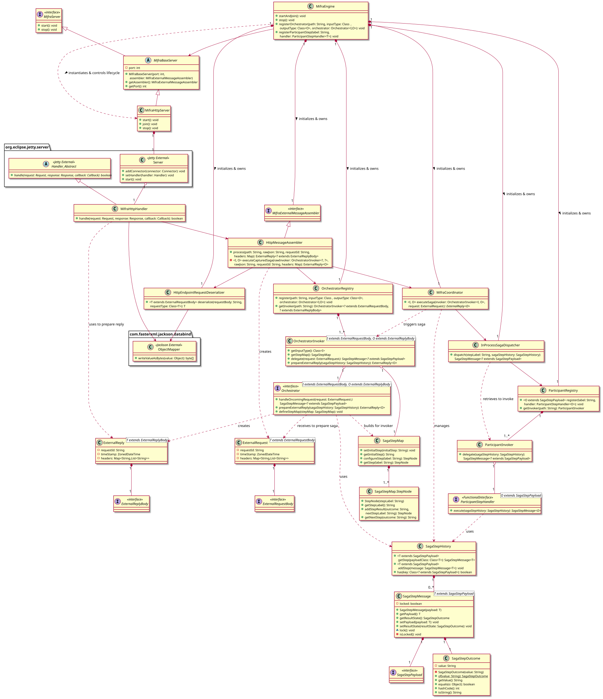

# Mifra

A lightweight, intelligent Java microservice framework designed to reduce distributed system latency via a hybrid local/remote Saga coordinator.

---

## Why Mifra Exists

In traditional orchestration-based, saga-driven architectures, microservices can suffer from the Chatty I/O antipattern and massive network overhead. In a previous enterprise production environment I was part of, which handled **20,000 requests/minute** at peak, we encountered a critical performance bottleneck:
* **90% of saga time was wasted in network.** A single successful saga flow could take up to 200ms to process, with up to **180ms wasted entirely on network round-trips** between the orchestrator and participants.
* Overcoming this required a massive and costly engineering effort to manually condense microservices back together just to eliminate network events.

Mifra was built from the ground up to provide the robust architectural foundations of a distributed Saga framework, but with superior efficiency featuring **Smart Routing**:

* If a saga participant is deployed remotely, Mifra handles standard network events between participants and orchestrator.
* If the framework detects that the next participant in the sequence resides within the *same* JVM, Mifra employs its **Zero-Latency feature**, by bypassing the network layer entirely — executing the logic via direct memory access while maintaining strict saga transactional guarantees.

---

## Architecture

In its current 0.1.0 iteration, Mifra's internal architecture is structured according to this diagram. For previous versions of Mifra, they are available at the ReadMe resources of each respective iteration branch.

### Mifra-Core 0.1.0 Class Structure

## Roadmap

The development of Mifra is structured in several distinct iterations, deliberately moving from a verified "happy path" architecture to a fully resilient, fault-tolerant framework.

Our current development roadmap is structured as follows:

* **[0.1.0 (Current)](https://github.com/jassunca/mifra-core/tree/0.1.0):** MVP featuring a functional Saga-pattern coordinator managing local orchestrators and participants. Successfully executes a valid, end-to-end saga flow from client request to final reply.
* **0.2.0:** Introduction of the asynchronous engine for parallel execution of independent saga steps.
* **0.3.0:** Refactoring and splitting `mifra-core` into distinct "core" and "api" libraries to support a clean modular system for future plug-ins, along with adding support for provision of configuration files.
* **0.4.0:** Introduction of network library modules to deploy and coordinate remote participants across network boundaries.
* **0.5.0:** Introduction of the repository library to manage data persistence and state tracking.
* **0.6.0:** Implementation of saga rollback and failure handling mechanisms *(intentionally scheduled here to build directly upon the 0.5.0 persistence layer for reliable state restoration)*.

Other features and advanced requirements will be added to the roadmap as the backlog matures.

## See It In Action

Since Mifra is a framework library, a companion **[Mifra Demo Application](https://github.com/jassunca/mifra-demo-orchestrator)** has been created to showcase how it integrates into a real-world project.

The demo application simulates an item request and inventory check system, demonstrating how Mifra coordinates several participants in a multiple path saga flow, while utilizing the **zero-latency JVM bypass** for local services.

For full instructions on how to clone, configure, and run the project locally, please see the **[Mifra Demo README](https://github.com/jassunca/mifra-demo-orchestrator#readme)**. A detailed explanation of the business logic implementation guidelines is provided in the project's Javadocs.